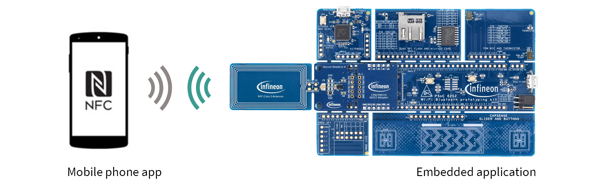
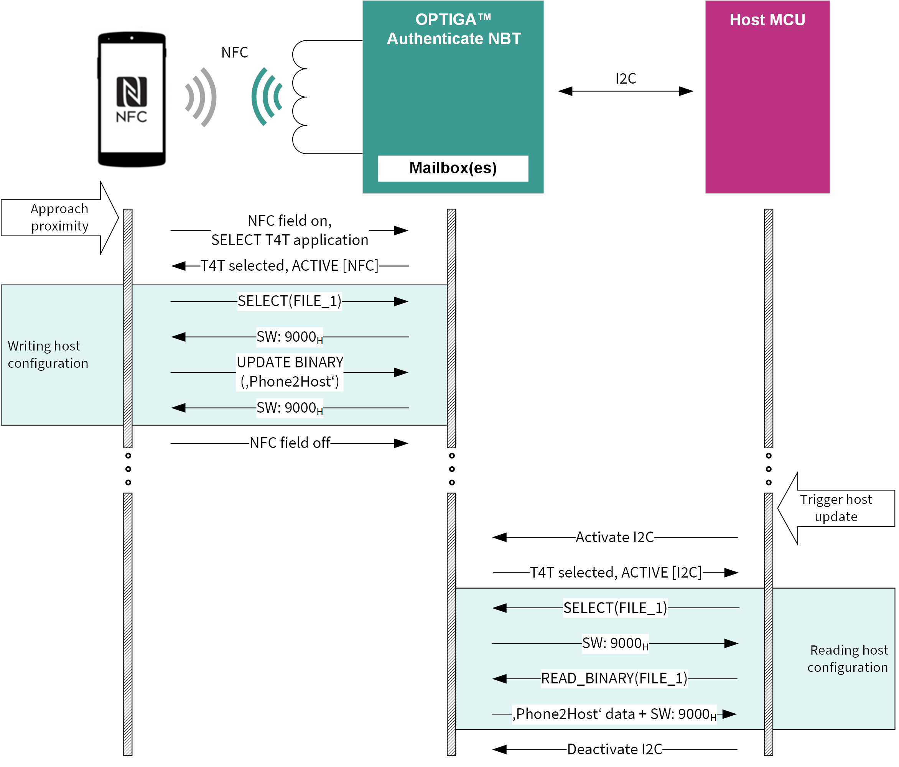
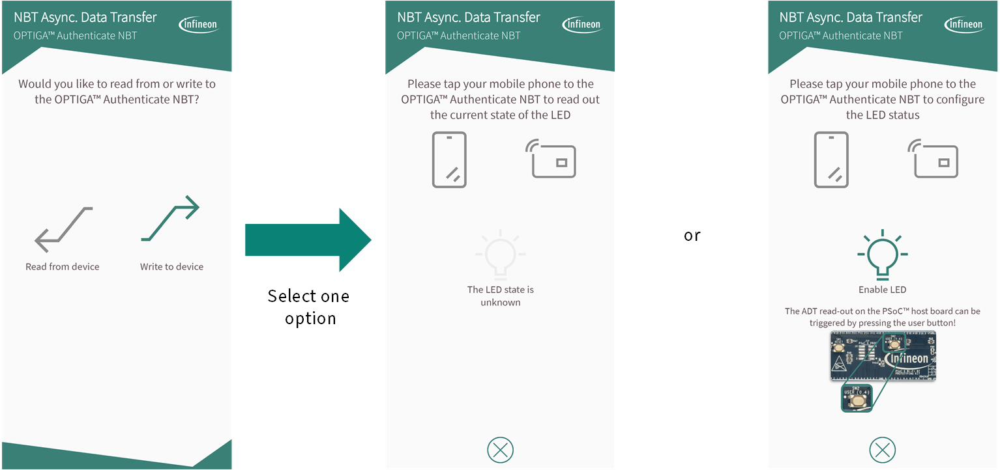

<!--
SPDX-FileCopyrightText: Copyright (c) 2024-2025 Infineon Technologies AG
SPDX-License-Identifier: MIT
-->

# OPTIGA™ Authenticate NBT ADT Application for Android

This is the *NBT Asynchronous Data Transfer* mobile phone app, a Java-based *Android Studio* project which showcases the OPTIGA™ Authenticate NBT in the *host parameterization via asynchronous data transfer (ADT)* use case.

## Overview

The example application enables an Android mobile phone to perform asynchronous NFC communication with a host device holding an embedded OPTIGA™ Authenticate NBT.
The main purpose of this implementation is to showcase the OPTIGA™ Authenticate NBT's *ADT mode* and to provide a simple example on how to use the [OPTIGA™ Authenticate NBT Host Library for Java](https://github.com/infineon/optiga-nbt-lib-java) in Android applications.

Refer to the [OPTIGA™ Authenticate NBT - GitHub overview](https://github.com/Infineon/optiga-nbt) repository for an overview of the available host software for the OPTIGA™ Authenticate NBT. The [OPTIGA™ Authenticate NBT - product page](https://www.infineon.com/OPTIGA-Authenticate-NBT) includes a dedicated Use Case Guide with detailed information on how to use the OPTIGA™ Authenticate NBT's ADT functionality.

### Features

- Android application with user interface and NFC communication capability
- Example implementation of the OPTIGA™ Authenticate NBT's ADT functionality
- ADT via OPTIGA™ Authenticate NBT's proprietary files
- Sample usage of the [OPTIGA™ Authenticate NBT Host Library for Java](https://github.com/infineon/optiga-nbt-lib-java) (version 1.1.1)

## Getting started

Information on how to setup and use this example application to evaluate the OPTIGA™ Authenticate NBT's *host parameterization via ADT* use case.

### Requirements

- NFC-enabled Android device running on API level 30 or higher (Android 11+)
- [OPTIGA™ Authenticate NBT Development Kit](https://www.infineon.com/OPTIGA-Authenticate-NBT-Dev-Kit), consisting of:
  - [OPTIGA™ Authenticate NBT Development Shield](https://www.infineon.com/OPTIGA-Authenticate-NBT-Dev-Shield)
  - [PSOC™ 62S2 Wi-Fi Bluetooth® Prototyping Kit](https://www.infineon.com/CY8CPROTO-062S2-43439) as host microcontroller board
- Associated example applications
  - *NBT Asynchronous Data Transfer* mobile phone app ([Android](https://github.com/Infineon/optiga-nbt-example-adt-android) **\*this application\*** or [iOS](https://github.com/Infineon/optiga-nbt-example-adt-ios))
    - Example application for the *host parameterization via ADT* use case
  - *NBT Asynchronous Data Transfer* embedded application ([ModusToolbox™](https://github.com/Infineon/mtb-example-optiga-nbt-adt))
    - Example application for the *host parameterization via ADT* use case
    - Targets the [PSOC™ 62S2 Wi-Fi Bluetooth® Prototyping Kit](https://www.infineon.com/CY8CPROTO-062S2-43439), included in the [OPTIGA™ Authenticate NBT Development Kit](https://www.infineon.com/OPTIGA-Authenticate-NBT-Dev-Kit)
  - *NBT Personalization* mobile phone app ([Android](https://github.com/Infineon/optiga-nbt-example-perso-android) or [iOS](https://github.com/Infineon/optiga-nbt-example-perso-ios))
    - (Optional) Example application for the *personalization of the OPTIGA™ Authenticate NBT via NFC*
    - To configure the OPTIGA™ Authenticate NBT for the desired use case or to reset it to its delivery condition

### Setup

This project is intended to be loaded and compiled using *Android Studio*. To do this, it is sufficient to download and import the project into *Android Studio* (by selecting File --> Open).

The associated example applications for this use case must be loaded onto their target devices.

- The embedded application needs to be flashed on the OPTIGA™ Authenticate NBT Development Kit
  - For flashing the PSOC™ microcontroller, it is recommended to use *ModusToolbox™*
- The mobile phone app(s) need to be installed on the mobile phone
  - For installing Android applications, it is recommended to use *Android Studio*
  - For installing iOS applications, it is recommended to use *Xcode*

### Usage

The example applications showcase the *host parameterization via ADT* use case by utilizing the OPTIGA™ Authenticate NBT's ADT functionality to transfer data from an NFC-enabled mobile phone to the embedded host system via NFC/I2C.

The use case is demonstrated with the simple example to parametrize the state of a LED on the OPTIGA™ Authenticate NBT Development Kit from the mobile phone app. Depending on the data sent by the Android application, the PSOC™'s LED is switched on or off.
In *ADT mode*, the data is transferred between the OPTIGA™ Authenticate NBT's NFC and I2C interface at different points in time. The data is written to the OPTIGA™ Authenticate NBT via one interface, stored in its file system, and later retrieved via the other interface.

To evaluate the use case, follow these steps:

- Make sure that NFC is enabled on the Android device
- Make sure that the OPTIGA™ Authenticate NBT is connected before powering the OPTIGA™ Authenticate NBT Development Kit
- Launch the *NBT Asynchronous Data Transfer* mobile phone app
- Choose "Read from device" and tap the phone to the OPTIGA™ Authenticate NBT. The state shown in the GUI should represent the actual LED state
- Choose "Write to device", select the desired LED state, and tap the mobile phone the OPTIGA™ Authenticate NBT
- Compared to the *Pass-Through (PT) mode*, there is no change to the LED state as the data is cached on the OPTIGA™ Authenticate NBT and later retrieved by the PSOC™ microcontroller
- Press the OPTIGA™ Authenticate NBT Development Kit's user button to trigger an update, reading the data from the OPTIGA™ Authenticate NBT and setting the LED state to the selected configuration

## Operational use case flow

In *ADT mode*, the OPTIGA™ Authenticate NBT acts as an asynchronous NFC to I2C bridge between the mobile phone and the host device which is connected via I2C.

To perform a host parametrization or configuration via ADT, the mobile phone initiates an NFC communication and stores the data in a file (for example, FILE_1) of the T4T Application.  When the host is ready to read the data from the OPTIGA™ Authenticate NBT, it will activate the I2C interface, select the T4T Application and read the stored data from this file. Additionally, the host can write data to a file (for example, FILE_2) to be read by the mobile phone via the NFC interface. The following figure depicts the command flow of an asynchronous data transfer mode.

## Graphical User Interface (GUI)

The GUI enables the user to interact with the Android application. In this particular use case, the user can choose between writing to or reading from the OPTIGA™ Authenticate NBT in the *ADT mode*.

To demonstrate a potential asynchronous data transfer, this example application is sending an on/off command to control a LED on the [PSOC™ 62S2 Wi-Fi Bluetooth® Prototyping Kit](https://www.infineon.com/CY8CPROTO-062S2-43439).
By choosing the *Read from device* option, the user can read out the current state of the LED and by choosing the *Write to device* option the user can enable or disable the LED using the *Disable LED / Enable LED* button.

In both cases, the OPTIGA™ Authenticate NBT needs to be tapped to the mobile phone to initiate the selected communication.

## High-level application flow

The first activity to be started is the main menu `MainActivity`, here the user can choose "Write to device" (`WriteActivity`) or "Read from device" (`ReadActivity`).

### Writing to device

To write to the device, the user needs to set the desired state of the LED in the GUI and tap the antenna of the OPTIGA™ Authenticate NBT device to the mobile phone. The detection of the NFC tag will trigger a cascade of commands that are handled in the methods of the `AdtUsecase` class.

`setStateByAdt()` will:

1. Select the application on the OPTIGA™ Authenticate NBT
2. Select the file on the OPTIGA™ Authenticate NBT
3. Write the LED state in the file (FILE_1) on the OPTIGA™ Authenticate NBT

### Reading from device

To read from the device, the user needs to tap the antenna of the OPTIGA™ Authenticate NBT device to the mobile phone. The detection of the NFC tag will trigger a cascade of commands that are handled in the methods of the `AdtUsecase` class.

`getStateByAdt()` will:

1. Select the application on the OPTIGA™ Authenticate NBT
2. Select the file on the OPTIGA™ Authenticate NBT
3. Read the LED state in the file (FILE_2) on the OPTIGA™ Authenticate NBT
4. Set the GUI accordingly

The user can return to the main menu by pressing the "Return" button on the bottom of the screen.

## Additional information

### Related resources

- [OPTIGA™ Authenticate NBT - product page](https://www.infineon.com/OPTIGA-Authenticate-NBT)
- [OPTIGA™ Authenticate NBT - GitHub overview](https://github.com/Infineon/optiga-nbt)

### Contributing

Please read [CONTRIBUTING.md](CONTRIBUTING.md) for detailed contribution instructions and refer to our [CODE_OF_CONDUCT.md](CODE_OF_CONDUCT.md).

### Contact

In case of questions regarding this repository and its contents, refer to [MAINTAINERS.md](MAINTAINERS.md) for the contact details of this project's maintainers.

## Licensing

Please see our [LICENSE](LICENSE) for copyright and license information.

This project follows the [REUSE](https://reuse.software/) approach, so copyright and licensing
information is available for every file (including third party components) either in the file
header, an individual *.license file or the [REUSE.toml](REUSE.toml) file. All licenses can be found in the
[LICENSES](LICENSES) folder.
